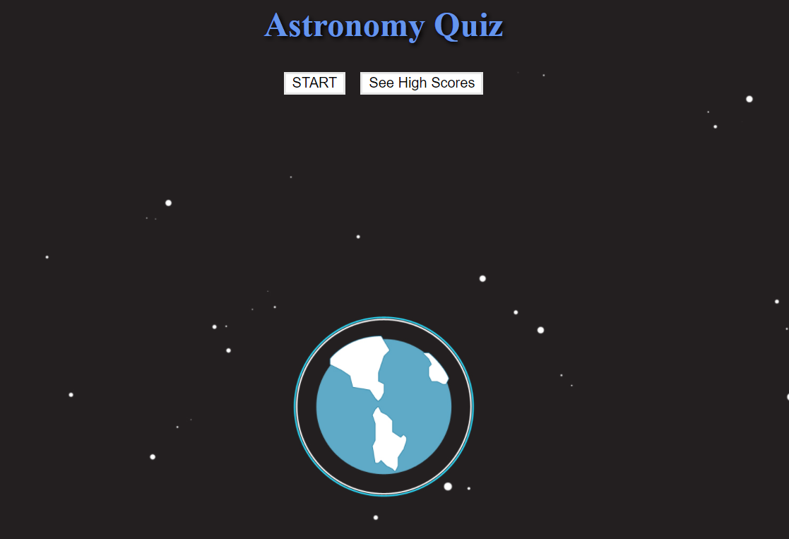

# Javascript Quiz

## Screenshot

## Overview

The purpose of this is to create an interactive challenge. This challenge is a multiple choice quiz of any kind utilizing javascript.
The subject of this quiz in particular is an astronomy.

## User Story

- As a User, I want a challenging multiple choice quiz with a set timer and the ability to record my score after based on the time left. The application stores this score on the client-side.

## Instructions

Proceeds as follows:

- The user arrives at the landing page and is presented with a call-to-action to "Start Quiz." Also note the navigation option to "View Highscores".

- Clicking the "Start Quiz" button presents the user with a series of questions. The timer is initialized with a value and immediately begins countdown.

- Score is calculated by time remaining. Answering quickly and correctly results in a higher score. Answering incorrectly results in a time penalty (for example, 15 seconds are subtracted from time remaining).

- When time runs out and/or all questions are answered, the user is presented with their final score and asked to enter their initials. Their final score and initials are then stored in `localStorage`.

# Info / Questions

- [Github](https:/github.com/Duhhvonte)
- devonte.letts@gmail.com